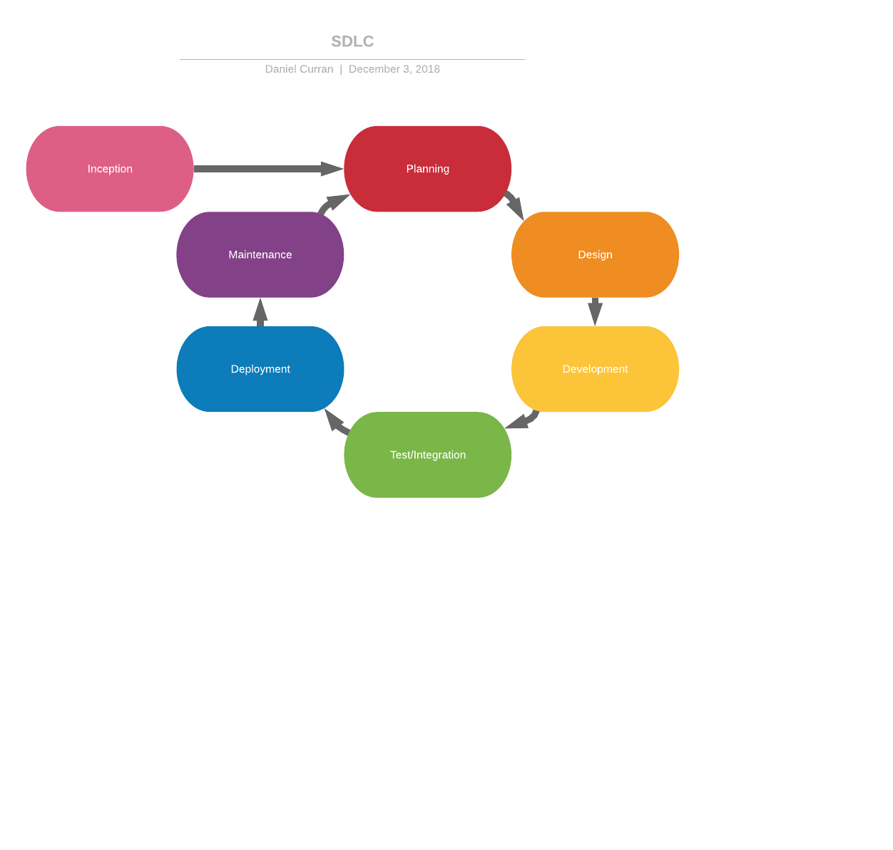
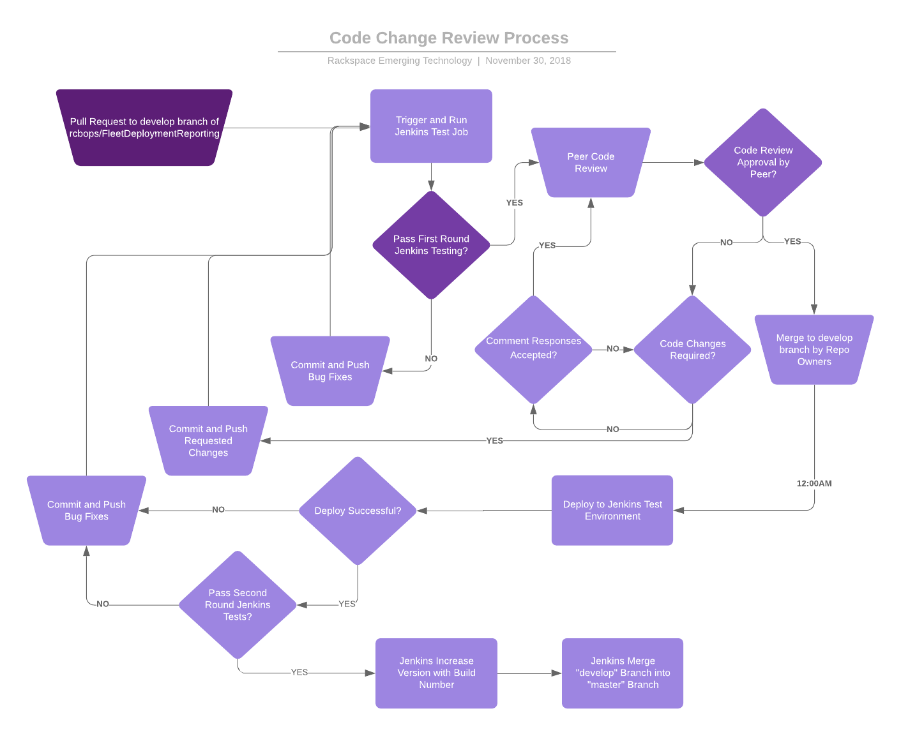

<!-- MarkdownTOC autolink="true" -->

- [Organization, Processes and Guidelines](#organization-processes-and-guidelines)
    - [Software Development Lifecycle](#software-development-lifecycle)
        - [High Level SDLC](#high-level-sdlc)
        - [Code Change Review Process](#code-change-review-process)
    - [SDLC Tools](#sdlc-tools)
    - [Secure Coding Guidelines \(PCI 6.5, 6.7\)](#secure-coding-guidelines-pci-65-67)
    - [Roles & Requirements](#roles--requirements)
    - [Operations & Maintenance](#operations--maintenance)
        - [RACI](#raci)
    - [Review Plans \(PCI 6.7\)](#review-plans-pci-67)
    - [Training Plans \(PCI 6.5\)](#training-plans-pci-65)
- [Inception](#inception)
    - [Concept Proposal](#concept-proposal)
- [Planning](#planning)
    - [Vision & Scope Specification](#vision--scope-specification)
- [Design](#design)
    - [Design & Tech Specifications](#design--tech-specifications)
    - [Impact, Capacity & Monitoring](#impact-capacity--monitoring)
        - [Monitoring](#monitoring)
    - [Release Plan \(PCI 6.2\)](#release-plan-pci-62)
- [Development](#development)
    - [Create Code & Prototype](#create-code--prototype)
    - [Submit Code Changes](#submit-code-changes)
    - [Unit Test](#unit-test)
    - [Review Failing Test Results](#review-failing-test-results)
    - [Code Review](#code-review)
    - [Incremental Review](#incremental-review)
- [Testing/Integration](#testingintegration)
    - [Build & Release to Development](#build--release-to-development)
    - [Run Second Round of Tests & Merge to Master](#run-second-round-of-tests--merge-to-master)
    - [Release to QA](#release-to-qa)
    - [Execute Long Term Test Plans](#execute-long-term-test-plans)
    - [Training Doc \(PCI 6.5\)](#training-doc-pci-65)
    - [User Acceptance & Training](#user-acceptance--training)
- [Deployment](#deployment)
    - [Release Approval](#release-approval)
    - [Deploy to Production](#deploy-to-production)
    - [Release to Production](#release-to-production)
    - [Confirm Release](#confirm-release)
- [Maintenance](#maintenance)
    - [Monitor, Resolve & Mitigate Issues](#monitor-resolve--mitigate-issues)
- [Tech Specfications](#tech-specfications)
    - [Architecture & High Level Design Diagrams](#architecture--high-level-design-diagrams)
    - [Environments \(PCI 6.4\)](#environments-pci-64)
    - [Testing](#testing)
    - [API](#api)
    - [Storage](#storage)
    - [Security \(PCI 6.7\)](#security-pci-67)
    - [Networking](#networking)

<!-- /MarkdownTOC -->

# Organization, Processes and Guidelines

## Software Development Lifecycle
* Definition: Documentation describing the SDLC
* Activities:
    - Determine the requirements of the project and limitations of the tools/environments
    - Design SDLC
* Deliverables:
    - SDLC diagram and description

#### High Level SDLC

#### Code Change Review Process

    Figure 2: Flow for handling code changes via pull requests and reviews (PCI 6.3.2)
6.3.2 Review code prior to release in order to identify any potential coding vulnerabilities:
Code changes reviewed by individuals other than the author.
Code reviews ensure code is developed according to secure coding guidelines
Appropriate corrections are implemented prior to release
Code review results are reviewed and approved by management prior to release

## SDLC Tools
* Definition: Documentation of the tools required for the SDLC
* Activities:
    - Find all tools used within the SDLC
* Deliverables:
    - Table with name and description of tooling

- Jira
    * Project management
    * Feature descriptions, designs and requirements discussions
- Jenkins
    * Automation for building, testing and deployment
- Django testing framework
    * Testing for web application
- Vagrant (subject to change)
    * Infrastructure provisioning for development and testing environments
- Ansible
    * Configuration management automation for green field deploys and upgrades
- Github
    * Source code management
    * Code review discussions
- Logging ?
- Security Testing
    * Codescan
    * Inspec
- RS Monitoring
- Slack

## Secure Coding Guidelines (PCI 6.5, 6.7)
* Definition: Guidelines by which to develop and review code to ensure security
* Activities:
    - Create and agree upon guidelines for producing code
    - Research common guidelines and agree upon a subset which will apply to specific project
    - Document means of enforcing guidelines
* Deliverables:
    - Documentation of guidelines

- PCI DSS
- Secure authentication
- Secure logging
- Best Practices
- I.S. during development

6.3 Develop internal and external software applications (including web-based administrative access to applications) securely, as follows:
In accordance with PCI DSS, secure authentication and logging
Based on industry standards and/or best practices.
Incorporating information security throughout the software-development lifecycle.

12.1 Establish, publish, maintain, and disseminate a security policy.

12.3.3 A list of all such devices and personnel with access
Possibly covered by P-RS-GL-CS-004.S001 Business Requirements of Access Control Standard

12.3.7 List of company-approved products
Possibly covered by P-RS-GL-CS-007.S001

12.3.8 Automatic disconnect of sessions for remote-access technologies after a specific period of inactivity
The ansible-hardening role applies security hardening configurations from the Security Technical Implementation Guide (STIG). Specifically, V-72223 sets a 10 minute timeout on remote communications.

## Roles & Requirements
* Definition: Define roles of team members and requirements of product
* Activities:
    - Determine roles and expectations of managers, developers, operators, and users
    - Define process and requirements for disseminating project information
* Deliverables:
    - RACI
    - System to require/remind team members to review documentation

### Roles

System management responsibilities are divided into the following roles:

- Manager
- Developer
- Operator
- User

A definition and non-exhaustive list of responsibilities for each role is provided below.

#### Manager

The responsibilities of the manager role include...

#### Developer

The responsibilities of the developer role include...

#### Operator

The responsibilities of the operator role include:

- Monitoring
- Alert response
- Troubleshooting
- Deployment
- Scaling

#### User

The responsibilities of the user role include...

## Operations & Maintenance
* Definition: Process and design of system(s) that facilitate secure, reliable and long term deployments
* Activities:
    - Document steps to deploy, migrate, scale and debug
    - Define processes for handling alerts and escalation
* Deliverables:
    - Operations Documentation
    - Implement notification and communication paths

### Deployment

### Migration

### Monitoring

### Incident Management Process

In the event of an outage notify the team via Slack and an email to pcdevops@rackspace.com, then engage the Rackspace IM team (link to their process here)

#### RACI

## Review Plans (PCI 6.7)
* Definition: Plan to disseminate information and documentation
* Activities:
    - Decide how often team members must review documentation for compliance
* Deliverables:
    - Documentation of team member requirements

All Cloud Snitch operations and developments team members must review documentation and send pull request to that affect once a year.
(Implement strategy to accomplish this. Comments on changelog PR?)

## Training Plans

6.5 Train developers at least annually in up-to-date secure coding techniques, including how to avoid common coding vulnerabilities.
12.6 Implement a formal security awareness program to make all personnel aware of the cardholder data security policy and procedures.

* Defition: Train developers at least annually in up-to-date secure coding techniques, including how to avoid common coding vulnerabilities.
* Activites:
    - Attend annual training
* Deliverables:
    - Sign-off in mylearn

Fleet deployment developers attend annual training delivered by https://mylearn.rackspace.com titled “Introduction to PCI DSS for Developers” (1 hour at your own pace). Contact the GES GRC team for additional details. (PCI 6.5.a)

Evidence of training is sign-off for all developers in https://mylearn.rackspace.com.

# Inception

## Concept Proposal
* Definition: Brief, informal discussion/description of the proposed product, feature, or design change
* Activities:
    - Discussion/Description of the following
    - Use case discussion
    - Business implication discussions
    - Externalities to the project i.e. dependencies, affected parties, stakeholders

# Planning

## Vision & Scope Specification
* Definition: Description and discussion of project updates
* Activities:
    - Summarize the update and it's purpose
    - Add priority to summary
    - Set status of update
    - Discuss relevant research, discoveries, or changes to requirements
* Deliverables:
    - Kanban card(s)

Each change will have a corresponding Kanban card with description.
[Cloud Snitch Jira](https://rpc-openstack.atlassian.net/secure/RapidBoard.jspa?rapidView=123)

Each Kanban card should describe some subset of the following:

- Goals & Intentions
- Scope & Feasibility
- Use cases
- Resources & Limits
- Cost/Time to Deliver
- Risks
- Additional Benefits
- Project Plan
- Milestones
- Additional Links

# Design

The following sections discuss the design 

## Design & Tech Specifications
* Definition: Diagrams and outlines of changes to be made
* Activities:
    - Create high level solutions
    - Whiteboard, discuss and adjust solution
    - Small first pass at code
    - Determine other software or teams to involve
    - Discover required data sources
    - Threat modeling
* Deliverables:
    - Diagrams/implementation plan or first pass of code
    - Notes/comments or emails for other teams to contact
    - Threat model

Architecture of the FleetDeploymentReporting Tool is as follow:

Tech specifications for new features may be added as bullet points and/or links whiteboard images in the corresponding Kanban card.
[Cloud Snitch Jira](https://rpc-openstack.atlassian.net/secure/RapidBoard.jspa?rapidView=123)

Consider the following technical sections to be updated with code or architectural changes:
- [Architecture & High Level Design Diagrams](#architecture--high-level-design-diagrams)
    * Diagrams of infrastructure, interfaces and redundancy
- [Testing](#testing)
    * Location of tests (if separate from others) along with testing technology and coverage
- [API](#api)
    * API specification describing endpoints, request types and responses
- [Storage](#storage)
    * Storage locations, security considerations and access rights
- [Security](#security)
    * Security technology, processes and due diligence
- [Networking](#networking)
    * Networking diagrams, connections and devices (firewalls, load balancers etc.)
- [Threat Model](#threatmodel)
    * Data or process diagram
    * List of risks and possible mitigation

## Impact, Capacity & Monitoring
* Definition: Define monitors to create, how and when to handle capacity based on monitors and impact to end users and operations
* Activities:
    - Define the metrics to determine capacity
    - Determine ranges that require scaling up or down
    - Create alerts and response processes
* Deliverables:
    - Alert/response documentation

### Monitoring

We will monitor trends in the following:

- latency in milliseconds of wait time
- traffic in requests per second
- errors in requests per second
- saturation as queue depth in celery requests and potentially database connections

We will alert when services are unreachable or the error rate increases. Specific rates and percentiles are yet to be determined.

### Alerting

Alerts signalling errors or failures will be set up via (ALERT TECHNOLOGY?) and send messages to the FleetDeploymentReporting development and operations team slack channel. They must be reviewed, communicated and handled according to the RACI documentation.

(INSERT TABLE OF ALERTS, RESPONSES AND SEVERITY)

In order to meet load requirements of end users the capacity should be increased/decreased according to the following chart.

(INSERT TABLE OF METRICS AND REQUIRED CAPACITY)

## Release Plan (PCI 6.2)

* Definition: Define plans for upgrades, schedules for releases and patch windows
* Activities:
    - Define release schedules
    - Create process for updating project to new versions
    - Create process for patching operating systems and dependencies
    - Define upgrade plans via configuration management tools
* Deliverables:
    - Documentation for release schedules, patches and updates

- Release to be scheduled once a month.
- Update all dependencies to latest versions
- Upgrades to be done in a manner that allows 
- Versioning schema. Semantic versioning with addition of a digit to represent Jenkins build number:
    * a - major (incremented when you make incompatible API changes)
    * b - minor (incremented when you add functionality in a backwards-compatible manner)
    * c - revision (incremented when you make backwards-compatible bug fixes)
    * d - build (incremented by automation system i.e. Jenkins)

# Development

6.4 Follow change control processes and procedures for all changes to system components with the following:
6.4.1 Separate development/test environments from production with ACLs to enforce separation.
6.4.2 A separation of duties between personnel assigned to the development/test environments and those assigned to the production environment.
6.4.3 Production data is not used for testing or development.
6.4.4 Removal of test data and accounts from system components before the system becomes active.
6.4.5 Change control procedure must include Documentation of impact, documented change approval by management, Functionality testing, and back out procedures.

## Create Code & Prototype

* Definition: Produce working prototype that can be demoed.
* Activities:
    - Update or create code in github
    - Deploy new code to development environment.
    - Add enough test data/infrastructure to perform a demo
* Deliverables:
    - New code in github
    - Short-lived demo deployment

- Develop and test changes locally
- Deploy to public cloud instance for demo/prototype deployment
- Produce test cases for new code. Document new frameworks, locations and coverage in [testing section](#testing)

## Submit Code Changes

* Definition: Developers produce code and send off for review
* Activities:
    - Create and test new code in development environment
    - Send PR to development branch of main repository
* Deliverables:
    - Pull Request

- Determine versioning changes that need to be made according to versioning schema in [release plan](#release-plan)
- Reflect any changes made in the [tech specifications](#tech-specifications) section
- Open a pull request to "develop" branch on central repository
- Check current pull request here: [FDR Pull Requests](#https://github.com/rcbops/FleetDeploymentReporting/pulls)

## Unit Test

* Definition: Automation gets pull request code and runs tests
* Activities:
    - CI/CD system runs unit test job
* Deliverables:
    - Passing checks on github

- Automation (Jenkins) will take pull request and use python virtual environment to install python dependencies
- Jenkins runs unit tests against code itself without full deployment

## Review Failing Test Results

* Definition: Test results should be long lasting and backed up
* Activities:
    - CI/CD system should saves test logs
    - Developer or peer reviews failures from unit tests
    - Developer fixes issues and pushes to pull request
* Deliverables:
    - Logs from test runs
    - Bug fixes within PR

- Test results can be seen from the "Details" link when Jenkins reports failures
- Code owner must review failing tests and discover problems within new or testing system
- Peers may optionally review tests to assist debugging
- Code owner must push bug fix pull request and allow re-run of unit tests 

## Code Review

* Definition: Peers review code and approve or request changes/discussion
* Activities:
    - Team member who is not code author reads through code
    - Ensure clarity and ease of understanding
    - Deploy code to dev environment and attempt to find issues
    - Consider and bring up security issues
* Deliverables:
    - Github reviews and comments

- Peer code reviewers must review code and ensure coding guidelines are followed
- Test changes locally to best of ability
- Code developer must respond to comments and/or requests for changes

## Incremental Review

    * Definition: Loop through development cycle until unit tests pass and peer approval achieved
    * Activities:
        - Continue from start of development cycle
    * Deliverables:
        - Code merged into development branch

- Loop through Development stage until pull request is accepted

# Testing/Integration

6.4 Follow change control processes and procedures for all changes to system components with the following:
6.4.1 Separate development/test environments from production with ACLs to enforce separation.
6.4.2 A separation of duties between personnel assigned to the development/test environments and those assigned to the production environment.
6.4.3 Production data is not used for testing or development.
6.4.4 Removal of test data and accounts from system components before the system becomes active.
6.4.5 Change control procedure must include Documentation of impact, documented change approval by management, Functionality testing, and back out procedures.

## Build & Release to Development

* Definition: Automation retrieves and builds peer approved and unit tested code from development branch
* Activities:
    - Create code artifacts and/or images
    - Install up-to-date dependencies to ensure security and compatibility
* Deliverables:
    - Code artifacts/Images

- Jenkins gets all code that has been merged into develop branch
- Jenkins uses provisioning system to create new development environment
- Jenkins sets up inventory and everything to prepare for Ansible run
- Ansible uses newly created development environment and deploys new code
- Ansible creates configuration files and dependencies
- Ansbile starts services, ensure all components have endpoint locations and dynamic data

## Run Second Round of Tests & Merge to Master

* Definition: Create development environment and install code
* Activities:
    - Create short-lived environment for second round of testing
    - Run green-field installation code
* Deliverables:
    - Test logs
    - Master branch with new code after successful deploy and test
    - Environment of failed deploy/test

- Use new development environment to run tests against
- Tests should include
    * Unit tests
    * Functional Tests
    * Component Tests
    * Fuzz tests
    * Static analysis
    * Property based tests
    * Coverage tests
    * Benchmark tests
    * Aggression tests
    * Contract tests
    * Lint tests
    * Acceptance tests
    * Mutation tests
    * Smoke tests
    * UI/UX tests
    * Usability tests
    * Penetration tests
    * Threat modelling
    * Integration tests

## Release to QA

* Notes: Would be great if we could test upgrade paths via old images or just deploying versions and testing upgrades
* Definition: Send code to environment with more accurate data to run long lived tests and load tests
* Activities:
    - Upgrade QA environment to new version
    - Ensure data migrations worked
    - Enable monitoring
* Deliverables:
    - Monitoring alerts
    - Environment location

- Upgrade QA environment with new code
- Ensure upgrade process works as expected
- Check ansible, application and service logs for immediate errors

## Execute Long Term Test Plans

* Definition: Run tests and close-to-production workloads against QA environment
* Activities:
    - test workloads, repeat close-to-production input
    - Run security tests
* Deliverables:
    - Test results
    - Alerts
    - Responses to issues

- Use QA Tests for longer term tests
    * Tap compare
    * Network monitoring
    * Load tests
    * Shadowing
    * Config tests

## Training Doc

6.5 Train developers at least annually in up-to-date secure coding techniques, including how to avoid common coding vulnerabilities.
12.6 Implement a formal security awareness program to make all personnel aware of the cardholder data security policy and procedures.

* Definition: Create training documentation for new features or products
* Activities:
    - Document information necessary for both users and operations based on templates
* Deliverables:
    - Training documentation

FleetDeploymentReporting team members attend annual security awareness training delivered by https://mylearn.rackspace.com. Additionally, FleetDeploymentReporting developers attend annual training delivered by https://mylearn.rackspace.com titled “Introduction to PCI DSS for Developers” (1 hour at your own pace). Contact the GES GRC team for additional details. (PCI 6.5.a)

Evidence of training is sign-off can be found in https://mylearn.rackspace.com

## User Acceptance & Training

* Definition: Provide beta versions to users or demos. Train users on new features/products
* Activities:
    - Deploy a beta version to get user feedback
    - Implement required changes by starting from planning stage
    - Schedule training sessions
* Deliverables:
    - Beta environment or demo
    - User feedback
    - Training sessions

# Deployment

6.3.1 Remove development, test and/or custom application accounts, user IDs and passwords before applications become active.
FDR does not utilize production code for test and vice versa.
6.4 Follow change control processes and procedures for all changes to system components with the following:
6.4.1 Separate development/test environments from production with ACLs to enforce separation.  
6.4.2 A separation of duties between personnel assigned to the development/test environments and those assigned to the production environment.
6.4.3 Production data is not used for testing or development.
6.4.4 Removal of test data and accounts from system components before the system becomes active. 
6.4.5 Change control procedure must include Documentation of impact, documented change approval by management, Functionality testing, and back out procedures.

## Release Approval

* Definition: Allow users, operations, and developers to approve new releases. Security patches may bypass users and operations
* Activities:
    - Schedule release/patch window
    - Talk to everyone affected to gain agreement
* Deliverables:
    - Approval via discussion

- Allow tests to run against production workload on pre-release production environment
    * Canarying
    * Monitoring
    * Traffic shaping
    * Feature flagging
    * Exception tracking
- Receive feedback and approval from beta and developer users

## Deploy to Production

* Definition: Run small deployment in production environment and verify
* Activities:
    - Deploy code to virtual machines in the production environment
    - Provide beta users optional access to new production environment
    - Provide developer users mandatory access to new production environment

## Release to Production

* Definition: Upgrade code in environment via rollout or in-place upgrade
* Activities:
    - Backup current data and environments
    - During scheduled windows run upgrade scripts
    - Notify users, operations and developers when release complete
* Deliverables:
    - Notifications to users, operations and developers
    - Upgraded production environment

- Change over all production load balancers
- Provide messages to users

## Confirm Release

* Definition: Consider user, operational and monitoring feedback and be ready to rollback
* Activities:
    - Read all comments, alerts and concerns
    - Rollback if major issues arise

- Tests within released environment
    * Teeing
    * Profiling
    * Logs/events
    * Chaos testing
    * Monitoring
    * A/B Tests
    * Tracing
    * Dynamic Exploration
    * Real user monitoring
    * Auditing
    * Oncall experience

# Maintenance

## Monitor, Resolve & Mitigate Issues

* Definition: Monitor and update system to ensure system runs securely and smoothly
* Activities:
    - Respond to monitoring alerts within appropriate an timeframe
    - Start patch/upgrade processes when vulnerabilities discovered

- Deploy each month
    * Allow patching updates
- Watch the following dependencies for all available security patches and deploy within 1 month of release (PCI 6.2)
    * (List of dependencies)

6.2 Ensure that all system components and software are protected from known vulnerabilities by installing application vendor supplied security patches within at least 1 month of release. 

10.8 Implement a process for timely detection and reporting of failures of critical security control systems including firewalls, IDS/IPS, FIM, anti-virus, strange login, audit logging mechanisms, and segmentation controls.

11.5 Deploy a change detection mechanism to alert personnel to unauthorized modification.
We utilize file integrity monitoring that polls nightly. We take response the next morning as per our SDLC guidelines.

11.6 Ensure that security policies and procedures for monitoring and testing are documented, in use, and known to all affected parties.

12.1 Establish, publish, maintain, and disseminate a security policy.
We have a section within our SDLC guidelines that all engineers adhere to. We have a github based process for updates that notifies appropriate people of change

12.4 Ensure that the security policy and procedures clearly define information responsibilities for all personnel.
TODO: link sdlc doc

12.10 Implement an incident response plan, and be prepared to respond immediately to a system breach.

# Tech Specifications

## Architecture & High Level Design Diagrams

## Environments (PCI 6.4)

6.4.1 Separate development/test environments from production with ACLs to enforce separation.
6.4.2 Separation of duties between development/test and production environments
6.4.3 Production data is not used for testing or development
6.4.4 Removal of test data and accounts from system components before the system becomes active.
6.4.5 Change control procedure must include Documentation of impact, documented change approval by management, Functionality testing, and back out procedures.
6.4.6 Upon completion of a significant change, all relevant pci dss requirements must be implemented on all new or changed systems as applicable.

- Phoebos - Development Environment
- Kronos - Production Environment

## Testing

[Web App Backend Tests](https://github.com/rcbops/FleetDeploymentReporting/tree/develop/cloud_snitch/tests)

- Django testing framework
- Cover basic models and functionality of the web application

## API

## Storage

- Cardholder data information (None? PCI 7.3)

7.3 Ensure that security policies and operational procedures for restricting access to cardholder data are documented.

## Security (PCI 6.7)

6.6 For public-facing web applications, address new threats and vulnerabilities on an ongoing basis and ensure these applications are protected against known attacks by either code audit tools or IDS devices.
8.8 Ensure that security policies and operational procedures for identification and authentication are documented, in use, and known to all affected parties.
10.9 Ensure that security policies and operational procedures for monitoring all access to network resources and cardholder data are documented, in use, and known to all parties.

- Codescan (PCI 6.6 [ARE WE PUBLIC FACING??])
- [Inspec](https://www.inspec.io/)

## Networking

## Threat Model
